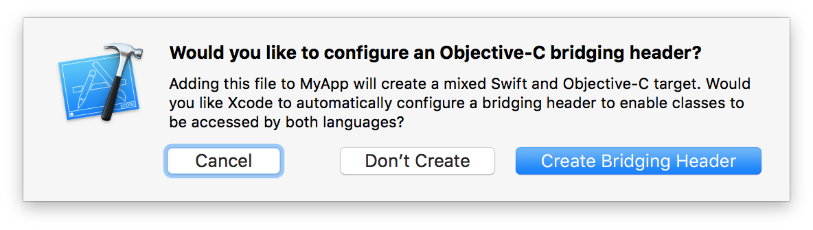

# Troubleshooting

Start with [Installation](./basics/installation.mdx) and confirm that only one
Track Player package is installed. Rebuild the native application after changing
native dependencies; refreshing Metro alone cannot update a compiled module.

## iOS: Swift integration and missing native modules

This fork requires the New Architecture and uses CocoaPods for iOS integration.
Run `bundle exec pod install` in the application's `ios` directory and open the
`.xcworkspace`, not the `.xcodeproj`. Check that the target includes the generated
pods and uses the deployment target required by its React Native version.

Modern React Native templates already contain Swift. An older Objective-C
application may need a Swift file and the bridging header offered by Xcode;
do not replace an existing header or AppDelegate just to enable Swift.

## Android: Java, Gradle or API-level build errors

Use the JDK, Android SDK, Gradle and Kotlin versions required by your React
Native template. Do not apply the old Java 8 or ExoPlayer 2 recipes to this fork.
Compare native build settings with the template for the application's exact
React Native version before changing dependencies.

Legacy error examples remain in the [v4.1 troubleshooting archive](../versioned_docs/version-4.1/troubleshooting.md).

## Android: `com.facebook.react.common.JavascriptException: No task registered for key TrackPlayer`

Register the [playback service](./basics/playback-service.md) once in the entry
file, immediately after registering the app with `AppRegistry`. Registration
must not depend on a React component mounting or a user opening the player screen.

## Android: Duplicate AndroidX and Support Library classes

This fork uses AndroidX. Identify and update or replace the dependency still
bringing in `com.android.support`; do not downgrade React Native or the player
to the old Support Library. Inspect Gradle's dependency report to find its source.

## Android: Cleartext HTTP traffic not permitted

Use HTTPS for media and artwork. If an application must access a specific
legacy HTTP endpoint, configure the narrowest required exception in Android's
[Network Security Configuration](https://developer.android.com/privacy-and-security/security-config).
Avoid disabling transport security for every domain.

## Web: Issues with HLS Streams

The supported Shaka 4 releases provide their own transmuxers. Installing
`mux.js` is not required by this fork. Check that the manifest, media segments
and any encryption-key requests are reachable, have valid CORS headers and use
codecs supported by the target browser.

Inspect `PlaybackState.error` for Shaka's error code and the browser's network
console for failed requests. Browser autoplay may require a user gesture.
See [Platform Support](./basics/platform-support.md) for the web backend's
queue, metadata and media-control limitations.
