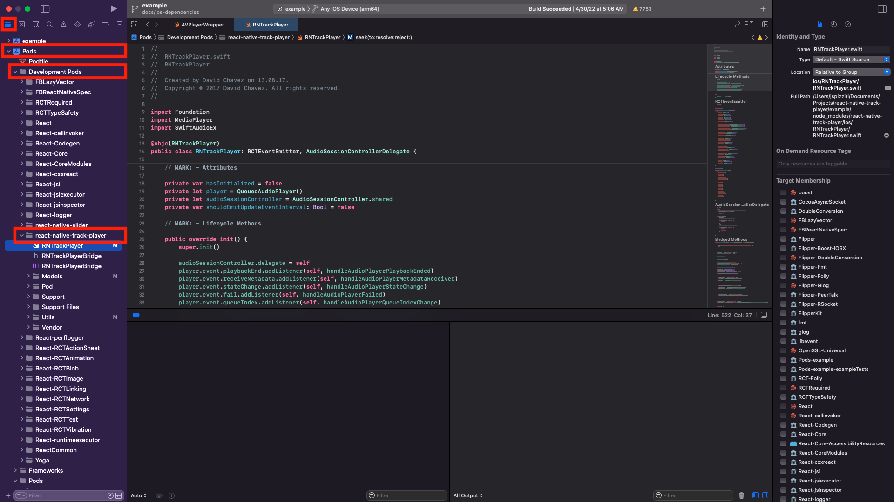
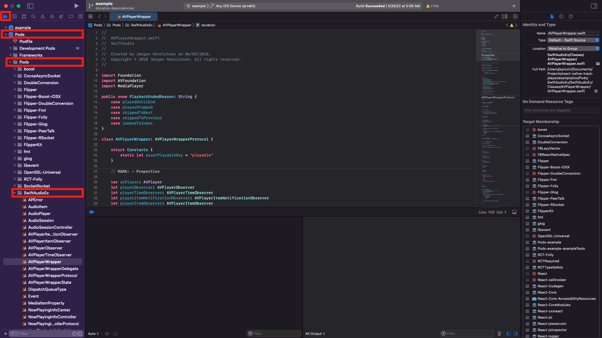

# RNTP Example App

This app is useful to simply try out the RNTP features or as a basis for
implementing new features and/or bugfixes.

It uses the local `@evopixel/react-native-track-player` fork with React Native
0.86.3 and React 19.2.3. Use Yarn Classic 1.22.22 and a Node.js version supported
by the root package. Android builds require JDK 17, Android SDK 36 and NDK
27.1.12297006; iOS builds require macOS, Xcode, Ruby 3.1 or later and Bundler
2.6.9. CI uses Ruby 3.3.

CI also builds this example with React Native 0.87.1 and Gesture Handler 3.3.0.
That compatibility fixture uses Android SDK/Build Tools 37, Kotlin 2.2.0 and
Gradle 9.4.1. The checked-in example stays on React Native 0.86.3.

## Running The Example App

```sh
git clone https://github.com/evopixelro/react-native-track-player.git
cd react-native-track-player
yarn install --frozen-lockfile
cd example
yarn install --frozen-lockfile
# On macOS, before building iOS:
bundle install
cd ios && bundle exec pod install && cd ..
```

## Library Development

If you want to use the example project to work on features or bug fixes in
the core library then there are a few things to keep in mind.

#### TS/JS

If you want to work on the typescript files located in `src` (in the root
project) you should run

```
cd example
yarn start
```

Metro reads the fork directly from the root `src` folder. Changes are reloaded
in the running example without rebuilding the npm package. Run `yarn android`
or `yarn ios` from another terminal in `example` to launch the app.

## iOS Native

It's recommended that you make your changes directly in XCode. Which you can
open quickly by running one of the following commands:

From inside the `example` directory:

```sh
yarn ios:ide
```

From the root directory:

```sh
npm --prefix example run ios:ide
```

Once opened you can simply navigate to the native dependencies, open their
source files, modify them, or add breakpoints. The screenshots below show how
to navigate to the react-native-track-player and SwiftAudioEx dependencies.




## Android Native

You can modify any android native code for RNTP by simply opening the example
android project in Android Studio and modifying the source:

**macOS Ex**

From inside the `example` directory:

```sh
open -a "Android Studio" android
```

From the root directory:

```sh
open -a "Android Studio" example/android
```

## KotlinAudio

The KotlinAudio implementation is included under `android/src/main/java` in
this fork. Edit these sources directly and rebuild the example; publishing a
separate KotlinAudio artifact to Maven Local is not required.

## Windows Native

The Windows host in `example/windows` uses React Native Windows 0.84.0 and
React Native 0.84.1. Its dependencies are separate from the Android/iOS host,
but it runs the same player UI and playback service from `example/src`.

Install Visual Studio 2026 with the React Native Windows C++ prerequisites
and use Node.js 22.13 or later in the 22.x line, or 24.3 or later. After
installing the root and example dependencies above, run from `example`:

```sh
yarn --cwd windows install --frozen-lockfile
yarn start:windows
# In another terminal:
yarn windows
```

Open `windows/native/TrackPlayerExample.sln` in Visual Studio to debug the
native module. `yarn build:windows` builds a Release example without launching
or deploying it; `yarn bundle:windows` checks the Windows JavaScript bundle.
See [Windows support](../docs/docs/basics/windows.md) for native platform limitations.

## macOS Native

The host in `example/macos` uses React Native macOS 0.81.9, React Native
0.81.6 and React 19.1.4. These dependencies are isolated from Android/iOS
and Windows; the player UI and service still come from `example/src`.

On a Mac with Xcode and macOS 14 or later, install the root and example
dependencies above, then run from `example`:

```sh
yarn --cwd macos install --frozen-lockfile
cd macos/macos && bundle exec pod install && cd ../..
yarn start:macos
# In another terminal:
yarn macos
```

`yarn bundle:macos` bundles the shared JavaScript for macOS.
`yarn build:macos` compiles an unsigned Release example. Open
`macos/macos/TrackPlayerExample.xcworkspace` to debug the native module.
See [macOS support](../docs/docs/basics/macos.md) for platform limitations.

## Web

After installing the root and example dependencies, run from `example`:

```sh
yarn web
```

Open `http://127.0.0.1:5173/`. The example uses React Native Web and Shaka
Player, with the same playlist and controls. Start playback with Play;
browser autoplay, codec and cross-origin restrictions still apply.
External live stations may change or reject browser playback. An unavailable
source is reported in the player; use Next or Previous to select another track.

```sh
yarn build:web
```

The production files are written to `example/web/build`. Serve that folder
over HTTP or HTTPS rather than opening `index.html` as a local file. Sample
audio and artwork use the original assets in this repository; the old
`rntp.dev/example` URLs are no longer available.

## Tests

The original `__tests__/App-test.tsx` location is retained. It now checks
rendering, initialization, an existing queue, Play/Pause, Previous/Next,
rejected commands, repeat-mode restoration and retry after setup failure.
`PlaybackService-test.ts` checks the remote media
commands, headset Play/Pause toggling, seeking, jumping and rejected commands.
`DesktopControls-test.tsx` checks the shared Web/Windows sheets, repeat-mode
selector and pointer, keyboard and accessibility seeking.

From the repository root, after installing both sets of dependencies:

```sh
npm run test:example
npm run check:example
```

Or from `example`:

```sh
yarn test
yarn typecheck
yarn lint
```

These tests mock the native audio module. They do not replace native builds
or playback checks on devices. The example Android release configuration uses
the debug signing key and is intended for local testing, not app publication.
